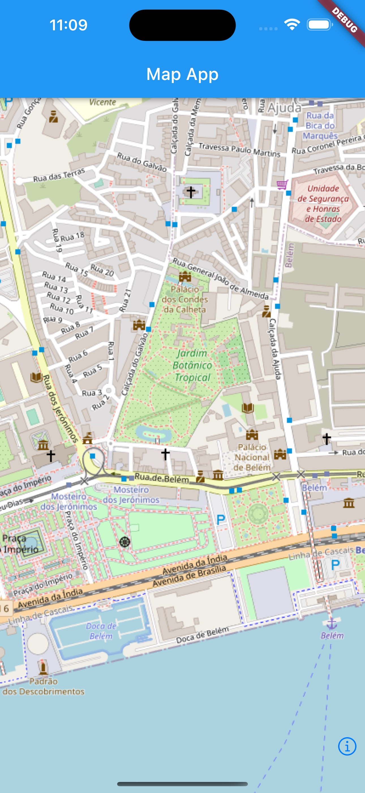
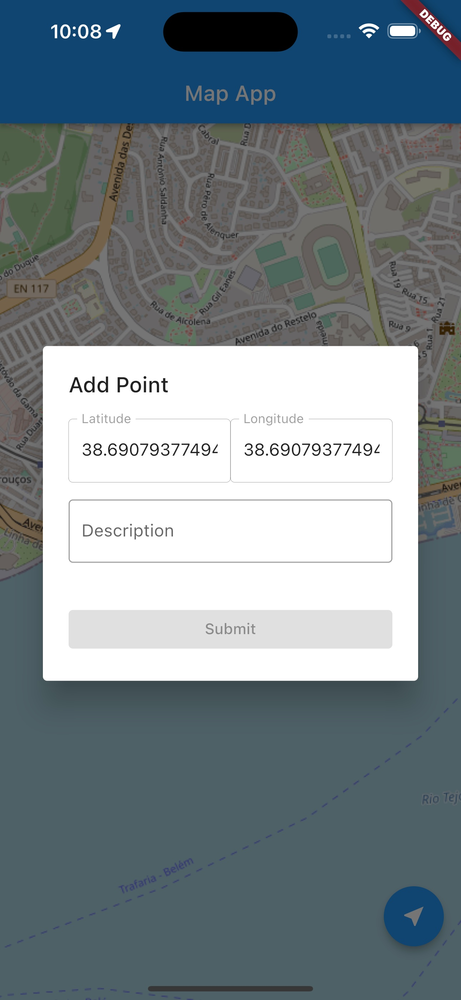
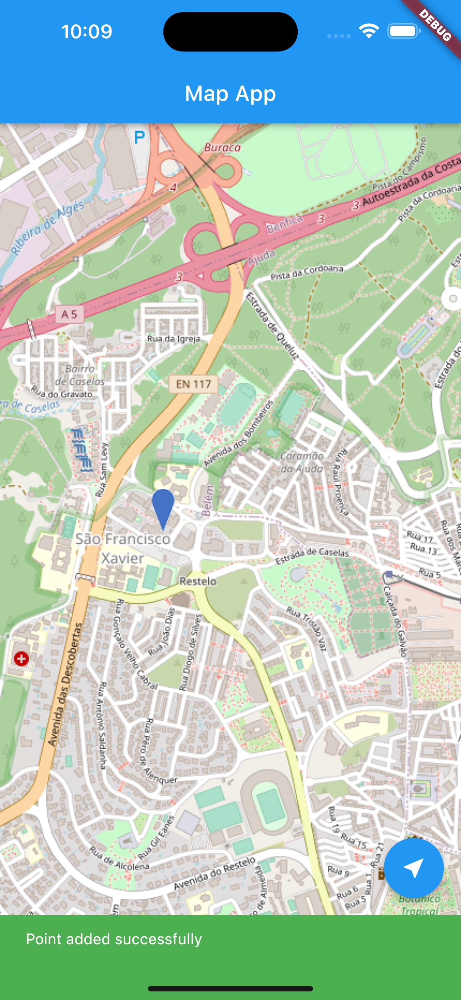
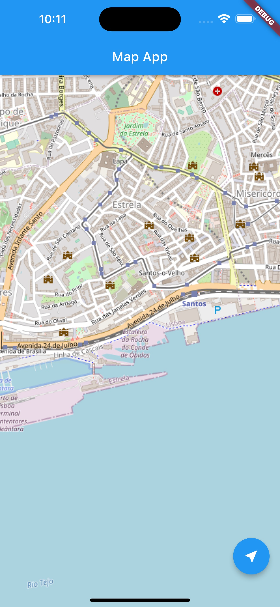

**Universidade Lusófona de Humanidades e Tecnologias**

# Sistemas Móveis Empresariais - Laboratório 5

## Introdução
Neste laboratório iremos desenvolver uma aplicação em Flutter que permite a utilização de um serviços de Mapas [FlutterMap](https://docs.fleaflet.dev/) para guardar pontos de interesse com base na sua geolocalização atual e criar uma lista de locais favoritos. Estes locais serão guardados no serviço da Firebase Firestore com alguns dados que sintam relevantes de serem guardados.

## Map App

No final do laboratório é esperado que consigamos visualizar um ecrãs semelhantes aos das figuras abaixo:

    
    
    

## Criação do projeto

Começemos pela criação de um projeto em Flutter com o auxílio da CLI.

~~~
flutter create sme_map_app
~~~

Em seguida, devem abrir o Android studio na diretoria criada com a instrução acima.

## Instalar dependências
Após o processo de configuração da Firebase SDK no novo projeto, necessitamos de software adicional ao disponibilizado pelo SDK fo Flutter que nos permite aceder aos serviços necessários de mapa e Firebase.

~~~
flutter pub add firebase_core cloud_firestore flutter_bloc bloc location formz flutter_map
flutter pub get 
~~~

# Ecrã Home (Mapa)

O FlutterMap é uma biblioteca Open-Source que permite a utilização de mapas em multiplas plataformas. Este providência a renderização de mapas de uma forma rápida e eficiente utilizando GPU com possibilidade de múltiplas configurações e ações sobre o mesmo.
Para começarmos, vamos colocar um simples mapa no ecrã inicial, modificando o **main.dart** para conter o seguinte:

~~~
import 'package:flutter/material.dart';
import 'package:firebase_core/firebase_core.dart';
import 'package:latlong2/latlong.dart';
import 'package:flutter_map/flutter_map.dart';
import 'firebase_options.dart';

void main() async {
  WidgetsFlutterBinding.ensureInitialized();
  await Firebase.initializeApp(options: DefaultFirebaseOptions.currentPlatform);
  runApp(const MyApp());
}

class MyApp extends StatelessWidget {
  const MyApp({super.key});

  // This widget is the root of your application.
  @override
  Widget build(BuildContext context) {
    return MaterialApp(
      title: 'Flutter Demo',
      theme: ThemeData(
        primarySwatch: Colors.blue,
      ),
      home: const MyHomePage(title: 'Flutter Demo Home Page'),
    );
  }
}

class MyHomePage extends StatefulWidget {
  const MyHomePage({super.key, required this.title});

  final String title;

  @override
  State<MyHomePage> createState() => _MyHomePageState();
}

class _MyHomePageState extends State<MyHomePage> {

  late final MapController _mapController;
  LatLng? location;

  @override
  void initState() {
    super.initState();
    _mapController = MapController();
  }

  @override
  Widget build(BuildContext context) {
    return Scaffold(
      appBar: AppBar(
        title: const Text("Map App"),
      ),
      body: Stack(children: [
        FlutterMap(
          mapController: _mapController,
          options: MapOptions(
            interactiveFlags: InteractiveFlag.all & ~InteractiveFlag.rotate,
            center: LatLng(38.6930771, -9.211939),
            zoom: 15,
            onTap: (pos, latLng) => _onMapClick(null, latLng)
          ),
          children: [
            TileLayer(
              urlTemplate: 'https://tile.openstreetmap.org/{z}/{x}/{y}.png',
            )
          ],
        )
      ]),
    );
  }
}
~~~

**Para que o ecrã Home funcione sem problemas, antes de executarem, devem adicionar as permissões necessárias para que seja possível aceder à geolocalização do telemovel. Para isso, devem adicionar as seguintes configurações respetivamente ao sistema operativo em que estão a desenvolver [Aqui](https://pub.dev/packages/location).**

Quando executarem finalmente, o ecrã deve estar algo parecido com a seguinte imagem:

    

Vamos criar agora um botão para nos colocar na posição atual, modificando o ficheiro **main.dart** com os seguintes trechos de código:

~~~
class _MyHomePageState extends State<MyHomePage> {

(...)

    Future<LatLng> _getCurrentPosition() async {
        Location location = Location();

        bool serviceEnabled;
        PermissionStatus permissionGranted;
        LocationData locationData;

        serviceEnabled = await location.serviceEnabled();
        if (!serviceEnabled) {
          serviceEnabled = await location.requestService();
          if (!serviceEnabled) {
            this.location = null;
          }
        }

        permissionGranted = await location.hasPermission();
        if (permissionGranted == PermissionStatus.denied) {
          permissionGranted = await location.requestPermission();
          if (permissionGranted != PermissionStatus.granted) {
            this.location = null;
          }
        }

        locationData = await location.getLocation();

        return LatLng(locationData.latitude!, locationData.longitude!);
    }
(...)

    void _goToCurrentPosition() {
        _getCurrentPosition().then((LatLng location) {
          _controller?.animateCamera(CameraUpdate.newCameraPosition(
              CameraPosition(target: location, zoom: 15)));
        });
    }

  @override
  Widget build(BuildContext context) {
    return Scaffold(
      (...)
        floatingActionButton: FloatingActionButton(
          onPressed: _goToCurrentPosition, child: const Icon(Icons.near_me)),
      (...)
    );
  }
}
~~~

* O método *_getCurrentPosition* executa os pedidos de permissões para a utilização dos sensores de geolocalização e verifica o tipo de permissões. Neste caso, as permissões que podem ser validadas são as de utilizar uma vez, ou apenas durante a aplicação. Assim, sempre que seja necessário saber a posição atual, são verificadas as permissões.
* O *_goToCurrentPosition* utiliza o *MapController* para realizar operações sobre o mapa, nomeadamente, anmimar a camara do mapa para que se desloque à posição atual do telemovel.
* O *floating action button* invoca a função anteriormente referida.

Devem visualizar o botão no canto inferior direito:

    

Vamos agora adicionar um *listener* ao mapa para que este quando deteta *clicks* execute um comportamento. Este será maioritariamente relevante quando quisermos guardar pontos de interesse. Adicionemos o trecho de código ao ficheiro **main.dart**.

~~~
(...)
  void _onMapClick(LatLng coordinates) {
    print(coordinates);
  }
(...)

MapOptions(
    (...)
    onTap: (pos, latLng) => _onMapClick(latLng),
    (...)
)
~~~

# Ecrã Add Point

Nesta função, que agora apenas realiza um print das coordenadas latitude e longitude que clicamos, vamos adicionar o comportamento em que seja possível inserir pontos no firebase através de um *dialog*. Para isso, necessitamos de criar alguns ficheiros que suportem esta ação.

Criemos o ficheiro **point_modal_form_state.dart** e adicionemos o seguinte código:

~~~
import 'package:equatable/equatable.dart';
import 'package:formz/formz.dart';
import 'package:latlong2/latlong.dart';
import 'package:sme_lab_5_code/required_field.dart';

class PointFormState extends Equatable {
  final RequiredField<LatLng?> latLng;
  final RequiredField<String?> description;
  final FormzStatus status;
  final String? errorMessage;

  const PointFormState(
      {this.latLng = const RequiredField.pure(null),
      this.description = const RequiredField.pure(null),
      this.errorMessage = '',
      this.status = FormzStatus.pure});

  @override
  List<Object?> get props => [latLng, description, status, errorMessage];

  List<FormzInput> get inputs => [latLng, description];

  PointFormState copyWith(
      {RequiredField<LatLng?>? latLng,
      RequiredField<String?>? description,
      FormzStatus? status,
      String? errorMessage}) {
    return PointFormState(
        latLng: latLng ?? this.latLng,
        description: description ?? this.description,
        status: status ?? this.status,
        errorMessage: errorMessage ?? this.errorMessage);
  }
}
~~~

Em seguida ficheiro de lógica, **point_form_cubit.dart**:

~~~
import 'package:formz/formz.dart';
import 'package:latlong2/latlong.dart';
import 'package:sme_lab_5_code/point_form_statel.dart';
import 'package:bloc/bloc.dart';
import 'package:sme_lab_5_code/required_field.dart';

import 'firebase_store_repository.dart';

class PointFormCubit extends Cubit<PointFormState> {
  final LatLng? latLng;
  final FirebaseStoreRepository firebaseStoreRepository;

  PointFormCubit({this.latLng, required this.firebaseStoreRepository})
      : super(const PointFormState()) {
    if (latLng != null) {
      latLngChange(latLng!);
    }
  }

  void latLngChange(LatLng value) {
    final latLng = RequiredField.dirty(value);
    List<FormzInput> inputs = [...state.inputs];
    inputs.remove(state.latLng);
    emit(state.copyWith(
        latLng: latLng, status: Formz.validate([latLng, ...inputs])));
  }

  void descriptionChange(String value) {
    final description = RequiredField.dirty(value);
    List<FormzInput> inputs = [...state.inputs];
    inputs.remove(state.description);
    emit(state.copyWith(
        description: description,
        status: Formz.validate([description, ...inputs])));
  }

  void addPoint() {
    // TODO - Use FirebaseStore method addPoint
    // Be sure to build the object to send here
  }
}
~~~

E em seguida o ficheiro de apresentação **point_form_cubit.dart**:

~~~
import 'package:flutter/material.dart';
import 'package:flutter_bloc/flutter_bloc.dart';
import 'package:sme_lab_5_code/point_form_cubit.dart';
import 'package:sme_lab_5_code/point_form_statel.dart';

class PointForm extends StatelessWidget {
  const PointForm({super.key});

  @override
  Widget build(BuildContext context) =>
      BlocListener<PointFormCubit, PointFormState>(
          listener: (context, state) {},
          child: Column(mainAxisSize: MainAxisSize.min, children: [
            _LatLngField(),
            const SizedBox(
              height: 16,
            ),
            _DescriptionField(),
            const SizedBox(height: 16),
            _SubmitButton()
          ]));
}

class _LatLngField extends StatelessWidget {
  @override
  Widget build(BuildContext context) =>
      BlocBuilder<PointFormCubit, PointFormState>(
          buildWhen: (previous, current) =>
              previous.description != current.description,
          builder: (context, state) => Row(
                children: [
                  Expanded(
                      child: TextFormField(
                    initialValue: state.latLng.value?.latitude.toString(),
                    key: const Key("point_form_latitude"),
                    onChanged: (value) {},
                    enabled: false,
                    decoration: const InputDecoration(
                      border: OutlineInputBorder(),
                      labelText: 'Latitude',
                    ),
                  )),
                  Expanded(
                      child: TextFormField(
                    initialValue: state.latLng.value?.longitude.toString(),
                    key: const Key("point_form_longitude"),
                    onChanged: (value) {},
                    enabled: false,
                    decoration: const InputDecoration(
                      border: OutlineInputBorder(),
                      labelText: 'Longitude',
                    ),
                  ))
                ],
              ));
}

class _DescriptionField extends StatelessWidget {
  @override
  Widget build(BuildContext context) =>
      BlocBuilder<PointFormCubit, PointFormState>(
          buildWhen: (previous, current) =>
              previous.description != current.description,
          builder: (context, state) => TextFormField(
                key: const Key("description_point_form"),
                onChanged: (value) {},
                decoration: InputDecoration(
                  border: const OutlineInputBorder(),
                  labelText: 'Description',
                  helperText: '',
                  errorText:
                      state.description.invalid ? 'Required field' : null,
                ),
              ));
}

class _SubmitButton extends StatelessWidget {
  @override
  Widget build(BuildContext context) =>
      BlocBuilder<PointFormCubit, PointFormState>(
          builder: (context, state) => SizedBox(
                width: double.infinity,
                child: ElevatedButton(
                    onPressed: state.status.isInvalid
                        ? null
                        : () {
                            context.read<PointFormCubit>().addPoint();
                          },
                    child: const Text("Submit")),
              ));
}
~~~

E por fim o ficheiro da página **point_form_page.dart**:

~~~
import 'package:flutter/material.dart';
import 'package:flutter_bloc/flutter_bloc.dart';
import 'package:latlong2/latlong.dart';
import 'package:sme_lab_5_code/firebase_store_repository.dart';
import 'package:sme_lab_5_code/point_form.dart';
import 'package:sme_lab_5_code/point_form_cubit.dart';
import 'package:sme_lab_5_code/point_form_statel.dart';

class PointFormPage extends StatelessWidget {
  final LatLng latLng;

  const PointFormPage({super.key, required this.latLng});

  @override
  Widget build(BuildContext context) => BlocProvider<PointFormCubit>(
        create: (_) => PointFormCubit(
            firebaseStoreRepository: context.read<FirebaseStoreRepository>(),
            latLng: latLng),
        child: BlocBuilder<PointFormCubit, PointFormState>(
          builder: (context, state) => const PointForm(),
        ),
      );
}
~~~

Vamos alterar ligeiramente o ficheiro **main.dart** para conter esta chamada do modal:

~~~
class MyApp extends StatelessWidget {
  const MyApp({super.key});

  // This widget is the root of your application.
  @override
  Widget build(BuildContext context) {
    return MultiRepositoryProvider(
        providers: [
          RepositoryProvider(create: (_) => FirebaseStoreRepository())
        ],
        child: MaterialApp(
          title: 'Flutter Demo',
          theme: ThemeData(
            primarySwatch: Colors.blue,
          ),
          home: const MyHomePage(title: 'Flutter Demo Home Page'),
        ));
  }
}

(...)
void _onMapClick(Point<double> point, LatLng coordinates) {
    showDialog(
        context: context,
        builder: (context) => AlertDialog(
              title: const Text('Add Point'),
              content: PointFormPage(latLng: coordinates),
            ));
  }
(...)
~~~

Neste momento conseguimos visualizar o dialog com as coordenadas onde clicamos, o mapa e colocar na posição atual onde nos encontramos. Seria pertinente saber em que sitio ao certo clicamos, uma forma de o fazermos é pela colocação de *markers* no mapa que, no fundo, serão os nossos pontos de interesse.

Primeiro, temos de ativar uma diretoria de *assets* que irá conter ficheiros multimédia. Modifiquemos o ficheiro **pubspec.yaml**:

~~~
(...)
  assets:
    - assets/custom-marker.png
    - assets/star.png
(...)
~~~

Se procurarem no ficheiro, está presente configurações exemplos de *assets*, perto da linha 75. 
Os ficheiros podem ser encontrados numa pasta do enunciado -> markers.
A diretoria a ser configurada deve ser criada no mesmo nível da pasta *lib* e configurada corretamente no ficheiro **pubspec.yaml**.

Em seguida, vamos modificar novamente o **main.dart** para conter funções que nos permitem colocar *markers*.

~~~
class _MyHomePageState extends State<MyHomePage> {
    late final MapController _mapController;
    LatLng? location;
    List<Marker> markers = [];

    (...)
    Marker _createMarker(LatLng coordinates) =>
      Marker(point: coordinates,
          height: 50,
          width: 50,
          builder: (context) => Image.asset("assets/custom-marker.png"));

    void _onMapClick(LatLng coordinates) {
        showDialog(
            context: context,
            builder: (context) => AlertDialog(
                title: const Text('Add Point'),
                content: PointFormPage(latLng: coordinates),
                ))
        // The data received here is the one sent in PointForm
        .then((value) {
            if (value) {
                markers.add(_createMarker(coordinates));
                setState(() {});
            }
        });
    }
    (...)
    FlutterMap(
        children: [
            (...)
            MarkerLayer(
                markers: markers,
                )
            (...)
        ]
    )
    (...)
}
~~~

* A alteração do método *_onMapClick* em que escutamos por um valor no após o push da rota. Este valor será um boleano que indicará se conseguimos adicionar com sucesso o ponto de interesse na firebase ou não.
* *Marker* é um widget que é adicionada à layer *MarkerLayer* através do array *markers*

Modifiquemos então o ficheiro **point_form.dart** para conter lógica necessária para enviar confirmação:

~~~
(...)
BlocListener<PointFormCubit, PointFormState>(
          listener: (context, state) {
            if (state.status.isSubmissionFailure) {
              ScaffoldMessenger.of(context)
                ..hideCurrentSnackBar()
                ..showSnackBar(SnackBar(
                    backgroundColor: Colors.red,
                    content: Text(state.errorMessage ?? '')));
            } else if (state.status.isSubmissionSuccess) {
              ScaffoldMessenger.of(context)
                ..hideCurrentSnackBar()
                ..showSnackBar(const SnackBar(
                    backgroundColor: Colors.green,
                    content: Text('Point added successfully')));
              // We can send data to the dialog answer here... 
              // For instance, the fields present in PointFormState
              // Which were the same we sent to firebase
              Navigator.pop(context, true);
            }
          }
(...)
~~~

* Usando o Navigator.pop(context, true) enviamos o valor para o ecrão que invocou o Dialog. Neste caso será o Home e irá avaliar o valor, se for *true*, é adicionado o Marker.
* No entanto ainda é necessário a criação do método que irá inserir a informações na Firebase Firestore

Criemos então a estrutura de dados correspondente a um Ponto de interesse **point_interest.dart**

~~~
import 'package:equatable/equatable.dart';

class PointInterest extends Equatable {
  final String uid;
  final String description;
  final double latitude;
  final double longitude;

  const PointInterest(
      {required this.description,
      required this.latitude,
      required this.longitude,
      this.uid = ''});

  @override
  List<Object?> get props => [description, latitude, longitude];

  factory PointInterest.fromJson(Map<String, dynamic> json) => PointInterest(
      uid: json['uid'],
      description: json['description'],
      latitude: json['latitude'],
      longitude: json['longitude']);

  Map<String, dynamic> toJson() => {
        "uid": uid,
        "description": description,
        "latitude": latitude,
        "longitude": longitude
      };
}
~~~

Falta-nos por fim adicionar o método no *FirebaseStoreRepository* que irá no fundo adicionar o *Point* numa coleção do Firebase, modificando o ficheiro **firebase_store_repository.dart**

~~~
(...)
Future<dynamic> addPoint(PointInterest pointInterest) => _firebaseFireStore
      .collection("point")
      .withConverter(
        fromFirestore: (snapshot, _) =>
            PointInterest.fromJson({'uid': snapshot.id, ...?snapshot.data()}),
        toFirestore: (PointInterest pointInterest, options) =>
            pointInterest.toJson(),
      )
      .add(pointInterest); // O resultado é uma DocumentReference que contém uma propriedade ID -> É o novo ID do Ponto 
(...)
~~~

* Utilizou-se uma funcionalidade que a API do firestore nos providencia *converters*, em que automaticamente convertem todas as estruturas de dados enviadas e recebidas para outras que sejam do nosso controlo.

# Exercicios

1. Como podem reparar, falta completar um método para que seja efetivamente possível adicionar o marcador no mapa e no firebase. Devem completar o método *AddPoint* no ficheiro **point_form_cubit.dart**;
2. Devem introduzir o conceito de pontos favoritos! Isto pode ser feito de múltiplas formas, contudo, é aconselhável olhar para as dicas no final do enunciado.. :)
3. Sempre que um ponto for favorito, deve ser apresentado um outro tipo de ícone;
4. Devem criar uma forma que seja possível visualizar a lista de favoritos fora do mapa. Podem colocar num Modal, num Dialog ou até mesmo uma nova rota;
5. Se fizerem refresh da aplicação, vão verificar que os pontos desaparecem, isto deve-se ao facto que não estão a ser inicializados quando a aplicação é executada pela primeira vez. Adicionem este comportamento.
6. (Opcional) Adicionem uma funcionalidade extra (da vossa imaginação) que interaja com o Mapa. Para este exercicio devem utilizar o *[MapController](https://pub.dev/documentation/flutter_map/latest/flutter_map/MapController-class.html)*.

# Dicas para os exercicios

1. Nos exercicios pedidos, uma das funcionalidades será a criação de uma lista de favoritos, para isso devem criar ações sobre os markers, isto pode ser feito da seguinte forma:

~~~
Marker _createMarker(PointInterest pointInterest) => Marker(
      point: LatLng(pointInterest.latitude, pointInterest.longitude),
      height: 50,
      width: 50,
      builder: (context) => GestureDetector(
        onTap: () => print(pointInterest.latitude),
        child: Image.asset("assets/custom-marker.png"),
      ));
~~~

Sendo que no listener *onTap* podem colocar outra lógica necessária... tal como abrir um menu.

2. Podem realizar queries com condições, exemplo:

~~~
_firebaseFireStore
      .collection("point")
      .where("property", isEqualTo: "value") // Utilização para favoritos?  -> where("favorite", isEqualTo: true)
      .get()
      .then((values) => ....)
~~~

3. Popular o mapa com os pontos, podem e devem fazê-lo tendo em conta o ciclo de vida de um StatefulWidget, utilizando o método *initState*:

~~~
@override
  void initState() {
    super.initState();
    _mapController = MapController();
    _firebaseStoreRepository.getAllPoints().then((points) => markers.addAll(points))
  }
~~~

